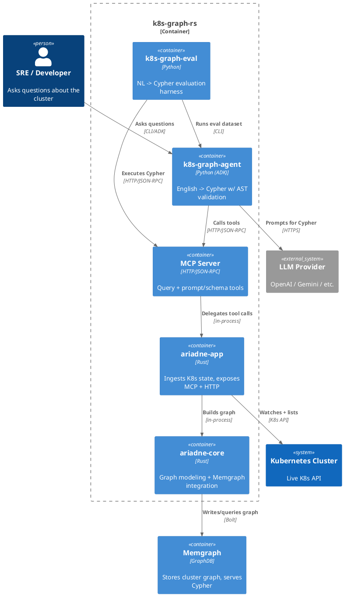

# Ariadne

Turn Kubernetes state into a **queryable graph**, then answer questions in **Cypher** or **natural language**.

This repo contains:
- **Rust ingestion + MCP server** that builds a live graph of your cluster in **Memgraph**
- **Python agent** that translates English -> Cypher with **AST-based validation**
- **Evaluation harness** to compare LLMs on this domain

## Why "Ariadne"?

In Greek mythology, Ariadne helped Theseus escape the Labyrinth by giving him a thread.
This project aims to do the same for complex Kubernetes systems: provide a reliable
path through the maze of resources and relationships.

---

## Why a graph (and why *not* raw JSON)?

**Kubernetes is not a tree.** It's a dense relationship network: Pods <-> Nodes, Services <-> EndpointSlices, Ingress <-> Service backends, Controllers <-> Pods, and more.

Feeding raw JSON to humans or LLMs causes:
- **Bloat**: huge payloads just to answer a small question.
- **U-shape problem**: real questions traverse *out* to related objects and *back* (e.g., "Ingress -> Service -> EndpointSlice -> Pod"). Trees make this awkward and expensive.
- **No stable join keys**: you end up hand-stitching references across separate JSON documents.

A **graph** keeps relations explicit and queryable, so questions become concise Cypher instead of multi-stage JSON parsing.

---

## What you get

- **Memgraph as GraphDB**: fast Cypher queries over the live cluster graph.
- **Smart K8s fetcher**: does an initial full list + **watches** for changes, so it stays up-to-date without constant polling.
- **MCP implementation**: exposes graph tools (query execution + prompt/schema) to LLM agents.
- **English -> Cypher agent**: uses Google ADK and **AST validation** to enforce schema/direction and Memgraph compatibility.
- **Evaluation harness**: benchmark LLMs for NL -> Cypher in this domain.
- **Snapshots**: export/import cluster state for reproducible tests.

---

## High-level architecture (C4 - Component)



**Core flow:**
1. Rust fetcher loads K8s objects and watches for changes.
2. Objects are materialized into a Memgraph property graph.
3. MCP server exposes tools to query the graph and retrieve prompt/schema.
4. Python agent converts English -> Cypher with AST validation + retries.

---

## Quick start

### 1) Start Memgraph (local)

```bash
docker compose up -d
```

Memgraph listens on `localhost:7687` and Memgraph Lab on `localhost:3000`.

### 2) Run the Rust app (graph + MCP server)

```bash
CLUSTER=tools.hk-tools-2t \
KUBE_CONTEXT=tools.hk-tools-2t \
cargo run --release -p ariadne-app
```

The app:
- builds the graph in Memgraph
- exposes HTTP endpoints (including MCP)

### 3) Ask questions with the Python agent

```bash
cd python/agent
uv venv
uv pip install -e .
```

```bash
MCP_URL=http://localhost:8080/mcp \
LLM_MODEL=openai/gpt-5.2 \
k8s-graph-agent --use-adk "What are the pods backing DNS name litmus.qa.agoda.is?"
```

---

## Snapshots (export/import)

Export a snapshot from a live cluster:

```bash
CLUSTER=tools.hk-tools-2t KUBE_CONTEXT=tools.hk-tools-2t \
  cargo run --release -p ariadne-app -- snapshot export --output-dir ./snapshot
```

Load a snapshot instead of talking to K8s:

```bash
CLUSTER=tools.hk-tools-2t KUBE_SNAPSHOT_DIR=./snapshot \
  cargo run --release -p ariadne-app
```

Snapshot directory format (JSON files per kind):
```
cluster.json
namespaces.json
pods.json
deployments.json
statefulsets.json
replicasets.json
daemonsets.json
jobs.json
ingresses.json
services.json
endpointslices.json
networkpolicies.json
configmaps.json
storageclasses.json
persistentvolumes.json
persistentvolumeclaims.json
nodes.json
serviceaccounts.json
events.json
```

---

## Agent: English -> Cypher with AST validation

The Python agent:
- pulls the prompt + schema from MCP
- generates Cypher
- validates it with an **ANTLR AST parser** to enforce schema and Memgraph compatibility
- retries on validation failure

This avoids common failures like wrong edge direction or unsupported Cypher features.

Agent docs: `python/agent/README.md`

---

## Evaluation harness (LLM quality)

Run NL -> Cypher evaluation with multiple models:

```bash
MCP_URL=http://localhost:8080/mcp \
LLM_MODEL=openai/gpt-5.2 \
  k8s-graph-eval --dataset ./eval/questions.yaml --mode retry --runs 3 --output ./eval/results.jsonl
```

The eval results let you compare LLMs for this **K8s-graph domain** and choose the best one.

---

## Development

### Build Rust
```bash
cargo build
```

### Run web UI
```bash
cargo run --release -p ariadne-app
```
Open: `http://127.0.0.1:18080/index.html`

### Build Docker image
```bash
APP_VERSION=$(cargo pkgid --manifest-path ariadne-app/Cargo.toml | cut -d '#' -f2)
docker build --platform linux/amd64 \
  --build-arg BUILD_DATE="$(date +'%Y-%m-%dT%H:%M:%S%z')" \
  --build-arg COMMIT_SHA=$(git rev-parse HEAD) \
  --build-arg VERSION="$APP_VERSION" \
  . -f docker/Dockerfile \
  -t k8s-ariadne-rs:$APP_VERSION
```

---

## Repo structure

- `ariadne-core/` - core graph + Memgraph integration
- `ariadne-app/` - K8s ingestion + MCP + HTTP server
- `ariadne-tools/` - schema generation tooling
- `python/agent/` - ADK agent, AST validator, eval harness

---

## License

See `LICENSE`.
