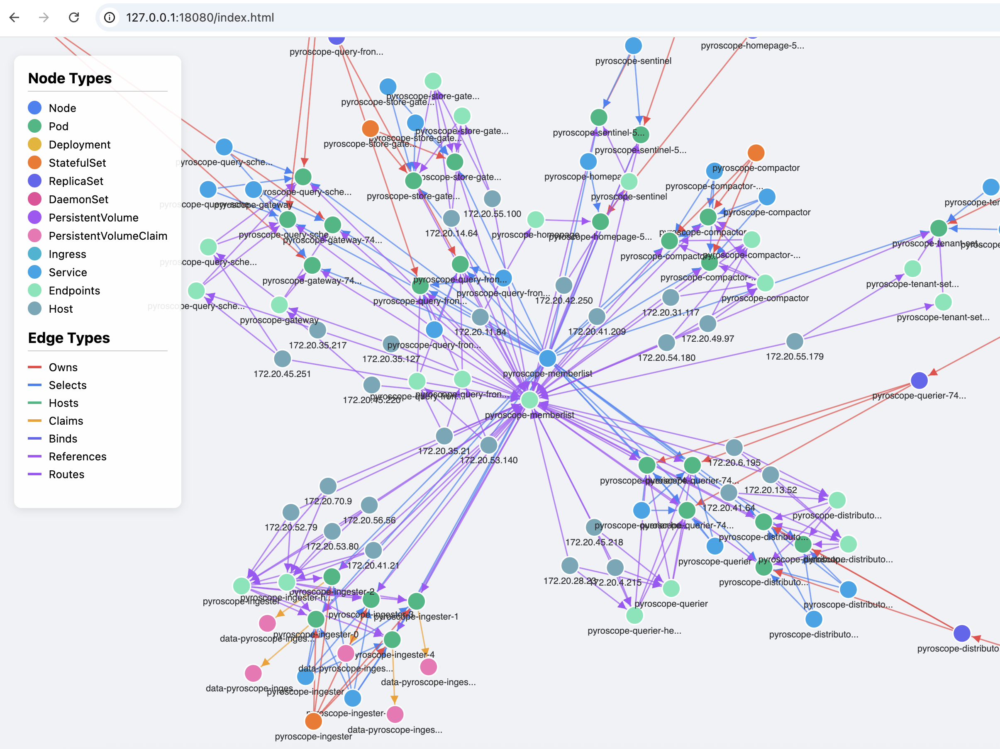

k8s-graph-rs
-----

Simple web application that discovers objects in Kubernetes cluster (K8S). It exposes an endpoint `/v1/graph` that
returns the
directed graph of K8S.

# High level details


# Development

The project requires the following tools configured on your developer machine:

- Cargo and Rust compiler installed, use [rustup](https://www.rust-lang.org/tools/install)

This project uses [kube](https://docs.rs/kube/0.91.0/kube/) Rust library to interact with K8S. Make sure you have
kubectl config, cluster's certificate-authority, user's certificate and key to be able to interact with cluster. By
default [kube](https://docs.rs/kube/0.91.0/kube/config/index.html) resolves in the following way:
> Kubernetes configuration objects from ~/.kube/config, $KUBECONFIG, or the cluster environment.

## Build the project

```bash
cargo build
```

## Run web app

```bash
cargo run --release
warning: `k8s-graph-rs` (bin "k8s-graph-rs") generated 1 warning
    Finished `release` profile [optimized] target(s) in 0.31s
     Running `target\release\k8s-graph-rs.exe`
2024-05-21T13:39:38.683877Z  INFO main ThreadId(01) k8s_graph_rs: src\main.rs:85: Created fetch_state_handle
2024-05-21T13:39:38.884332Z  INFO main ThreadId(01) k8s_graph_rs: src\main.rs:117: Server listening for HTTP on 127.0.0.1:18080
2024-05-21T13:39:38.886641Z  INFO main ThreadId(01) k8s_graph_rs: src\main.rs:126: Server shutdown
2024-05-21T13:39:38.886807Z  INFO main ThreadId(01) k8s_graph_rs: src\main.rs:50: Starting fetch_state
```

## Open browser at http://127.0.0.1:18080/index.html

