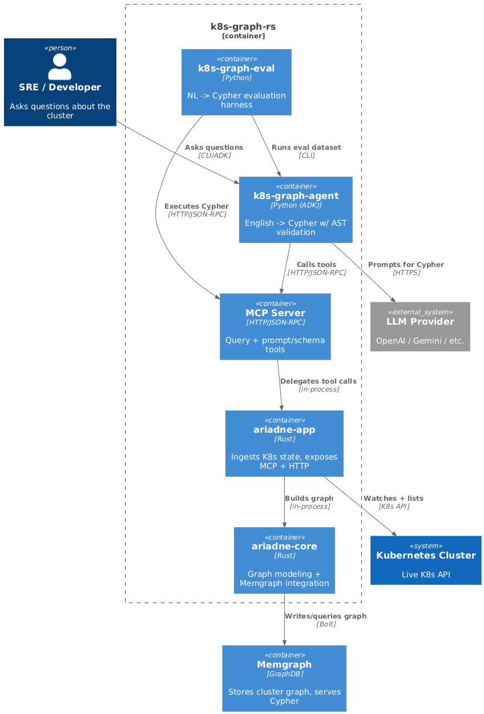

# Architecture

## High-level architecture (C4 - Component)

Diagram source: [docs/diagrams/c4/component.puml](diagrams/c4/component.puml).

Core flow:
1. Rust fetcher loads K8s objects and watches for changes.
2. Objects are materialized into a Memgraph property graph.
3. MCP server exposes tools to query the graph and retrieve prompt/schema.
4. Python agent converts English -> Cypher with AST validation + retries.
