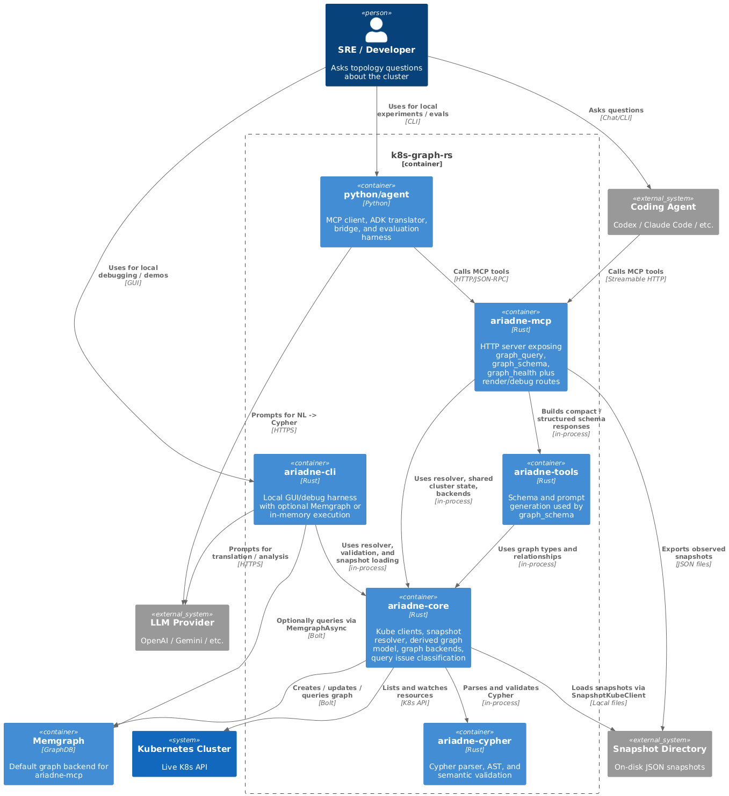

# Architecture

## High-level architecture (C4 - Component)

Diagram source: [docs/diagrams/c4/component.puml](diagrams/c4/component.puml).

The PlantUML source is the authoritative diagram. Render `component.png` from it when PlantUML
is available locally.

## Primary roles

- `ariadne-core`
  - Kubernetes state ingestion for live clusters and snapshots
  - `ClusterStateResolver` that builds `ObservedClusterSnapshot`, derives logical resources, and materializes `ClusterState`
  - graph backends (`memgraph`, in-memory)
  - shared Cypher validation
  - shared `QueryIssue` classification for repairable query failures

- `ariadne-mcp`
  - primary product interface
  - Axum HTTP server that mounts a streamable HTTP MCP service at `/mcp`
  - exposes three deterministic tools: `graph_query`, `graph_schema`, `graph_health`
  - supports live cluster mode and snapshot mode
  - wires health reporting, sync loops, snapshot export, and render/debug routes around `ariadne-core`
  - defaults to compact, model-friendly schema and health responses

- `ariadne-tools`
  - machine-readable schema generation and compact schema/prompt helpers used by `graph_schema`

- `ariadne-cypher`
  - tree-sitter parser, AST, and semantic validation used by `ariadne-core`

- `ariadne-cli`
  - local harness for debugging, demos, and UI experimentation
  - uses the same resolver and validation flow directly, with either `MemgraphAsync` or `InMemoryBackend`
  - not the primary external interface

- `python/agent`
  - MCP client, ADK translator, bridge, and evaluation harness for NL -> Cypher workflows
  - explicitly requests structured schema when it needs full machine-readable details

## Core flow

1. `ariadne-core` reads Kubernetes objects from a live cluster via `CachedKubeClient` or from disk via `SnapshotKubeClient`.
2. `ClusterStateResolver` builds an `ObservedClusterSnapshot`, derives logical resources such as `Container`, `Host`, `IngressServiceBackend`, `Endpoint`, and `EndpointAddress`, and materializes `ClusterState`.
3. A `GraphBackend` executes against that state. `ariadne-mcp` defaults to `MemgraphAsync`; `ariadne-cli` can use either `MemgraphAsync` or `InMemoryBackend`.
4. `ariadne-mcp` exposes the graph over streamable HTTP MCP at `/mcp` and also serves render/debug routes under `/render/*`.
5. In live mode, `ariadne-mcp` runs source-sync and optional rebuild loops. In snapshot mode, it loads from disk and disables source sync.
6. Agents usually call `graph_query` directly when the traversal is already known. They call `graph_schema` when labels, properties, or traversal directions are uncertain, and `graph_health` when freshness or sync status materially matters.

## Design intent

Ariadne is optimized for topology questions, not raw object inventory.

- `kubectl` is still a good fit for direct inventory and shallow reads.
- Ariadne is a better abstraction for relationship-heavy questions such as:
  - `Host -> Ingress -> IngressServiceBackend -> Service -> EndpointSlice -> Endpoint -> EndpointAddress -> Pod`
  - `Service -> EndpointSlice -> Endpoint -> EndpointAddress -> Pod`
  - `Deployment -> ReplicaSet -> Pod`
  - `Pod -> PersistentVolumeClaim -> PersistentVolume -> StorageClass`

Those are the concrete graph paths exposed by the schema. Shorthand prose sometimes collapses the
helper nodes, but the actual Cypher surface keeps them explicit.

The MCP server is the main distribution layer, while the CLI and Python tooling remain local
harnesses around the same shared core crates.
