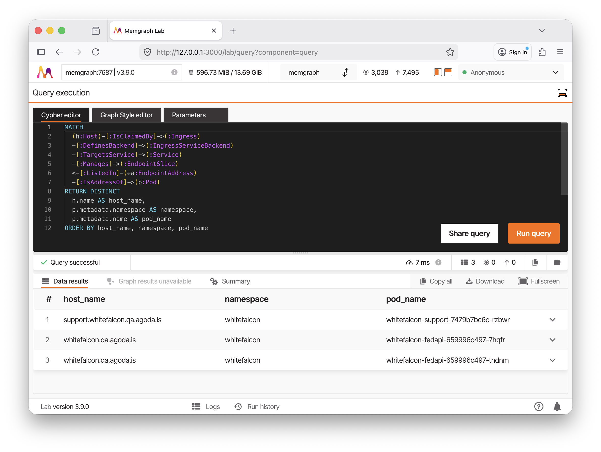

# Building a Kubernetes Graph Engine for Agents

**Artavazd (Art) Balaian**  
Senior Lead Software Engineer, Agoda

Memgraph Developer Community

---

# The Problem

- Managing Kubernetes at scale means asking the same questions repeatedly
- Which pods are failing?
- What changed in this service?
- Is it safe to reshuffle workloads?
- `kubectl` is excellent for inspection, but poor for connected reasoning across resources

---

# What I Wanted

- A live model of the cluster, not just point-in-time CLI output
- A way to ask cross-resource questions naturally
- A system that works for both engineers and AI agents
- A graph that preserves Kubernetes structure instead of flattening it away

---

# Ariadne in One Slide

- Ariadne turns Kubernetes cluster state into a property graph
- The graph is stored in Memgraph
- Engineers can query it with Cypher
- Agents can access it safely through MCP tools

Flow:

`Kubernetes API -> Rust snapshot + diff engine -> Memgraph -> MCP server -> humans / agents`

---

# Why a Graph?

- Kubernetes is already a graph in practice
- Deployments manage ReplicaSets
- ReplicaSets manage Pods
- Pods run Containers and Nodes host Pods
- Services map to EndpointSlices and then to Pod addresses
- Ingress points to Service backends

**Graph queries make these traversals direct instead of procedural**

---

# A Real Kubernetes Cluster Looks Like a Graph

---

# Why Memgraph

- Kubernetes objects are deeply nested and irregular
- Metadata, labels, annotations, specs, and status fields vary a lot
- Many resources contain maps inside maps and lists inside lists
- Memgraph’s flexible property model let me keep that shape without heavy denormalization
- Cypher made operational traversals concise and readable
- Native Bolt protocol via `rsmgclient` for direct, low-overhead communication with Memgraph

---

# Cypher Made Kubernetes Traversals Practical

  
  

    This query resolves an external hostname all the way down to the Pods currently backing it.
  

---

# Data Model

- 23 Kubernetes resource types become graph nodes (Pods, Deployments, Services, Nodes, Ingress, ...)
- Ariadne also derives logical nodes for graph-native concepts:
  - `Container`, `Endpoint`, `EndpointAddress`, `Host`, `IngressServiceBackend`
- 20+ named edge types make relationships explicit:
  - `Manages`, `RunsOn`, `ClaimsVolume`, `TargetsService`, `DefinesBackend`, ...

**This keeps the graph queryable at the level engineers actually reason about**

---

# Architecture

- `ariadne-core` — Kubernetes access, snapshot building, diffing, and graph updates
- `ariadne-cypher` — tree-sitter openCypher parser for AST validation
- `ariadne-mcp` — HTTP / MCP interface with graph query, schema, and health tools
- `ariadne-tools` — schema and prompt generation helpers
- `Rust` for ingestion and sync: predictable latency for the diff engine, memory safety for a long-running daemon
- `Python` for experimentation around agent workflows

---

# How Ariadne connects Kubernetes, Memgraph, and MCP

---

# Snapshot + Incremental Sync

Bootstrap

  
K8s API full snapshot

  
→

  
Derive graph entities + edges

  
→

  
Materialize into Memgraph

Steady state (every 2 s)

  
Poll new snapshot

  
→

  
Compute diff

  
→

  
Apply incremental graph updates

  
→

  
↻ repeat

Key idea:

`full snapshot for initialization, incremental diffs for steady state`

---

# Numbers From a Real Cluster

  

    <h3>Cluster + Graph</h3>
    
21 namespaces, 338 Pods, 57 Services, 22 Nodes

    
~3.0k graph nodes

    
~7.5k edges across 70 edge types

  

  

    <h3>Bootstrap</h3>
    
Source snapshot read: 479 ms

    
Graph derivation: 2 ms

    
Resolver bootstrap: 675 ms

    
Initial graph build: 5.9 s

  

  

    <h3>Steady State</h3>
    
Poll interval: 2 s

    
Typical fetch: 5 ms

    
Typical diff: 32 ms

    
Observed freshness lag: ~1.1 s

    
Example updates applied in 17-35 ms

  

Initial load is seconds; keeping the graph fresh is tens of milliseconds.

---

# Why Incremental Changes Matter

- Full rebuilds are straightforward but expensive
- Clusters change constantly
- Most sync cycles have small deltas
- Incremental updates reduce backend work and make freshness practical
- I still keep a rebuild path as a correctness and recovery fallback

---

# MCP as the Agent Boundary

- Early question: how should agents interact with the graph safely?
- Raw DB access was too open-ended
- MCP gave me a narrow, explicit interface
- Three tools, each with compact and detailed modes:
  - `graph_query` — execute read-only Cypher; returns columns, rows, and timing
  - `graph_schema` — compact text by default, optimized for model token budgets
  - `graph_health` — readiness, sync freshness lag, degraded resource coverage

MCP made agent integration operationally simpler and safer

---

# What the Agent Actually Needs

- Not just data access, but also:
  - schema awareness so the model knows what labels and edges exist
  - health and freshness so the model knows when to trust results
  - bounded response sizes to avoid flooding the context window
  - validation before execution to catch errors early
  - structured error classification: each issue carries `repairable` and `retryable` flags

The agent can self-correct on a schema error, but knows to stop on a permission failure

This is where MCP worked better than "just let the model talk to the database"

---

# Demo: Three Questions Ariadne Can Answer Live

1. Which Deployment serves `whitefalcon.qa.agoda.is`, how many Pods back it, and on which Nodes?
2. If I drain `hk-wf-2q-vm-20-pg5kk`, which public hostnames are impacted?
3. Which Services depend on persistent volumes, and what StorageClass are they on?

---

# Experiments Along the Way

- Different LLMs for natural-language-to-Cypher
- Prompt tuning and prompt search
- DSPy experiments for improving query planning
- Evals to measure query correctness and failure modes
- Intermediate representations (IR) for safer planning before final Cypher generation

The lesson:

**Model quality matters, but interfaces and validation matter more**

---

# Typed IR: Useful, Not Default

- I also evaluated a typed IR between English and Cypher
- The reason: models often understood the question but still made mechanical Cypher mistakes
- The idea was to let the model describe the graph intent and let a compiler produce valid Memgraph Cypher
- It was promising on some cheaper models, but it did not beat direct Cypher consistently enough
- The conclusion: useful experiment, but better schema design, tool boundaries, and validation had higher ROI

---

# Where I Hit Problems

- Hallucinated property paths
- Incorrect traversal directions
- Overly broad queries
- Schema representations that were either too vague or too verbose
- Tension between model freedom and operational safety

These problems pushed the design toward better tool boundaries and better schema shaping

---

# Validation and Guardrails

  
<strong>Parse</strong>Syntax via tree-sitter

  
<strong>Semantic</strong>Read-only enforcement

  
<strong>Schema</strong>Labels, edges, inline filters

  
<strong>Execution</strong>Memgraph runs query

- Each stage can reject early with a classified, `repairable` error
- Structured errors let the agent self-correct instead of guessing
- Response limits to avoid flooding the model with noise

Design principle:

- Memgraph is the source of truth for Cypher syntax
- Ariadne is the source of truth for graph semantics and safety
- Goal: make the safe path the default path

---

# Why No Inline Property Filters in MATCH?

- Ariadne stores Kubernetes objects as **nested maps**
- Inline property maps easily turn into **accidental whole-map equality checks**
- `WHERE` makes nested-field filtering explicit and reliable

Example:

- risky: `MATCH (ns:Namespace {metadata: {name: 'tempo'}})`
- safe: `MATCH (ns:Namespace) WHERE ns['metadata']['name'] = 'tempo'`

---

# Evaluation Setup

- Dataset: 162 gold questions
- Each case includes a question, reference Cypher, and expected result set
- Three classes:
  - Easy: inventory and count
  - Medium: multi-hop traversal and joins
  - Hard: aggregation and nested-resource reasoning
- I tracked not just correctness, but also validity, execution errors, and retry behavior
- The goal was to compare models and prompt/tool changes before trusting the agent

---

# Eval Results: Frontier Models

| Model                 | Correctness % | Query Validity % | Retry % | Retry Success % |
|-----------------------|---------------|------------------|---------|-----------------|
| **GPT-5.4**           | **98.1**      | 100.0            | 0.6     | 100.0           |
| **Claude Sonnet 4.6** | **97.5**      | 100.0            | 3.7     | 100.0           |
| **Gemini 3 Pro**      | **96.3**      | 100.0            | 2.5     | 100.0           |
| **Gemini 3.1 Pro**    | **95.7**      | 100.0            | 3.7     | 83.3            |
| Claude Sonnet 4.5     | 94.4          | 99.4             | 3.7     | 83.3            |
| Claude Opus 4.5       | 92.0          | 98.8             | 3.7     | 50.0            |
| Claude Opus 4.6       | 92.0          | 100.0            | 3.1     | 100.0           |
| DeepSeek R1           | 92.0          | 99.4             | 8.0     | 92.3            |

Query Validity = executes without error. Correctness = returns the expected result.
Most incorrect queries never retried — they ran successfully but returned wrong answers.

**Frontier models were consistently strong; interface design and validation mattered more than raw model choice.**

---

# Eval Results: Local Models

| Model              | Correctness % | Query Validity % | Retry % | Retry Success % |
|--------------------|---------------|------------------|---------|-----------------|
| **Gemma-4-31b-it** | **85.8**      | 99.4             | 5.6     | 88.9            |
| Gemma-4-26b-a4b-it | 80.9          | 92.6             | 1.2     | 9.9             |
| Gemma-4-e4b-it     | 49.4          | 88.3             | 49.4    | 76.2            |
| Gemma-4-e2b-it     | 30.2          | 52.5             | 56.8    | 16.3            |

- Smaller local models dropped off significantly
- Useful for constrained environments, but frontier models were still more reliable

---

# What I Learned

- Kubernetes is a graph-shaped problem — Memgraph let me model it as one without fighting the data
- Incremental sync is what makes a live graph practical; full rebuilds would not scale to a 2-second poll
- MCP as the agent boundary was the single best architectural decision — narrow tools beat raw DB access
- The hardest part was not the model, but the data shape, validation, and evaluation around it

---

# Where Ariadne Can Go Next

- Extend the graph to CRDs and more native resource types
- Adaptive schema views that evolve with what the agent has queried
- Stronger Cypher repair loops driven by structured validation errors
- Production evals grounded in real operator questions
- Developer workflows: change-impact analysis, graph-based alerting

---

# Thank You

**Building a Kubernetes Graph Engine for Agents**

[github.com/REASY/k8s-ariadne-rs](https://github.com/REASY/k8s-ariadne-rs.git)

Questions?
